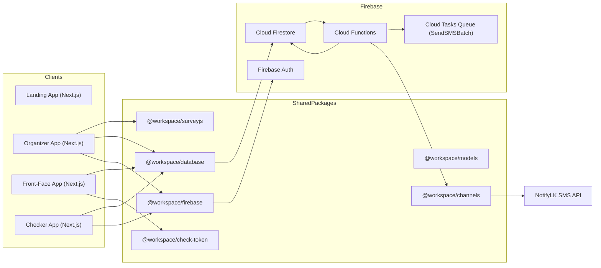
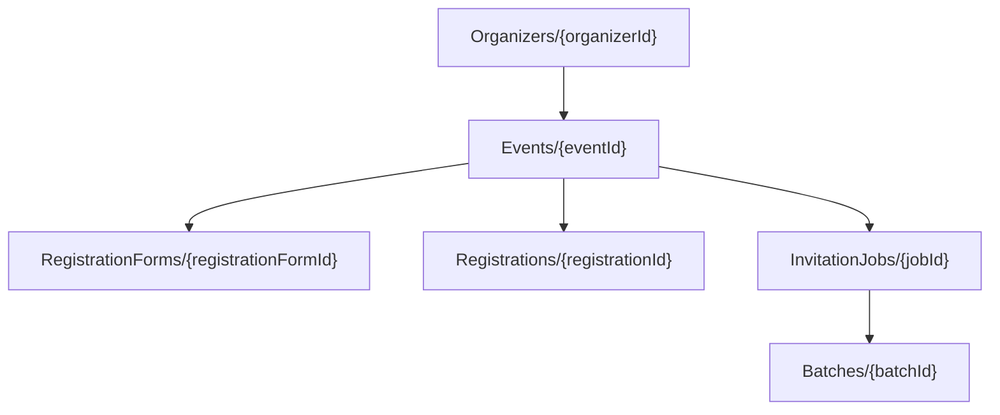
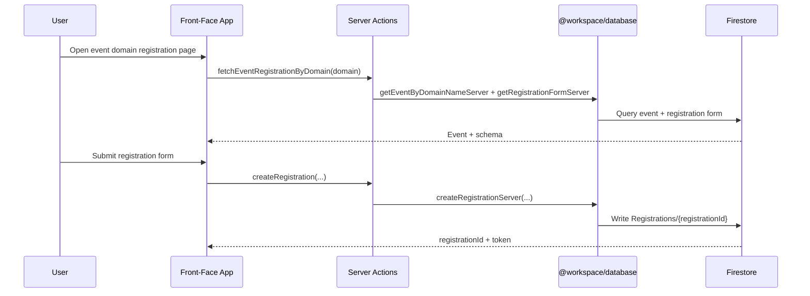
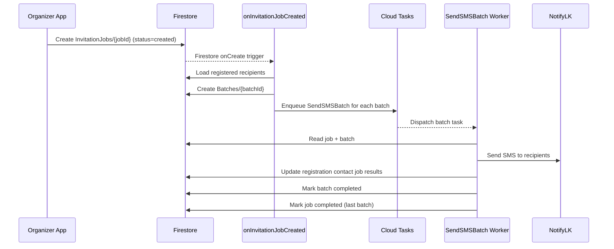

# EventUp Platform Architecture

## 1. Overview
EventUp is a **pnpm + Turborepo monorepo** with multiple Next.js apps, shared domain/data packages, and Firebase Functions for asynchronous messaging workloads.

### Primary runtime surfaces
- `apps/landing`: Marketing site and onboarding flow.
- `apps/organizer`: Organizer dashboard for event setup, participants, registration forms, invitations, and checker assignment.
- `apps/front-face`: Public event registration + invitation view.
- `apps/checker`: QR scanner/check-in app.
- `functions`: Firebase Functions (Firestore trigger + task queue worker).

### Shared package layers
- `packages/models`: Domain types (event, registration, invitation job, registration form, user).
- `packages/database`: Firestore read/write adapters (client + server variants).
- `packages/firebase`: Firebase client/admin initialization and auth helpers.
- `packages/channels`: Notification channel integrations (NotifyLK SMS).
- `packages/check-token`: Registration token signing/verification utilities.
- `packages/surveyjs`: Dynamic form editor/renderer used for registration forms.
- `packages/ui`: Shared UI primitives.

## 2. High-Level System Diagram


## 3. Monorepo Structure
```text
/
├─ apps/
│  ├─ landing
│  ├─ organizer
│  ├─ front-face
│  └─ checker
├─ packages/
│  ├─ ui
│  ├─ surveyjs
│  ├─ models
│  ├─ database
│  ├─ firebase
│  ├─ channels
│  ├─ check-token
│  ├─ const
│  └─ utils
└─ functions/
   └─ src/
      ├─ triggers/invitation-job/on-create.ts
      └─ task-queue/send-sms-batch.ts
```

## 4. Firestore Data Shape
Collection constants indicate a nested organizer/event hierarchy:



## 5. Key Runtime Flows

### A) Public registration flow (front-face)


### B) Invitation job async pipeline


### C) Check-in flow (checker + organizer tools)
- Checker/organizer interactions resolve registration by `registrationId` (collection group query).
- Status transitions commonly end in `checked-in` with `checkInData` append.
- Status updates can also be driven from organizer UI via authenticated safe-action server actions.

## 6. Cross-Cutting Concerns
- Auth:
  - Firebase client auth in apps.
  - Organizer additionally creates server session cookie (`__session`) validated in safe-actions.
- Validation:
  - Zod-based env validation in app/package env modules.
  - SurveyJS uses Zod schema generation at render-time.
- Build/Deploy:
  - Turbo orchestrates app/package tasks.
  - Firebase Functions bundled via esbuild (`functions/build.js`).

## 7. Observed Architectural Risks / Inconsistencies
- Mixed Firestore path conventions:
  - Some modules use nested constants (`Organizers/.../Events/...`), others hardcode flat lowercase collections (`events`, `organizers`, `registrations`).
- Client packages importing server-only code in places (risk in browser builds).
- Type/import naming mismatches (`event` vs `Event` paths, typo files like `get.sever.ts`).
- `packages/database/event/get.server.ts` currently mutates `date` to a placeholder string (`"edwde"`), which can break consumers expecting real timestamps.
- Invitation job creation is currently client-initiated in organizer UI and partially TODO-labeled; lifecycle exists, but orchestration hardening is still in progress.

## 8. Suggested Next Architecture Steps
1. Standardize all database adapters on one Firestore path model (prefer constants).
2. Split `@workspace/database` into explicit `client` and `server` entrypoints.
3. Enforce import/path lint rules for server-only modules and casing consistency.
4. Define token/check-in contract end-to-end (generation, QR payload, verification, status write).
5. Add integration tests for:
   - registration creation
   - invitation trigger -> batch enqueue
   - batch worker success/failure transitions

## 9. Guardrail Commands
- Run `pnpm check:architecture` before merge.
- This check enforces:
  - no deprecated import/path patterns (`get.sever`, `db/Event`, legacy database module paths)
  - no `@workspace/database/server/*` imports inside `"use client"` modules
